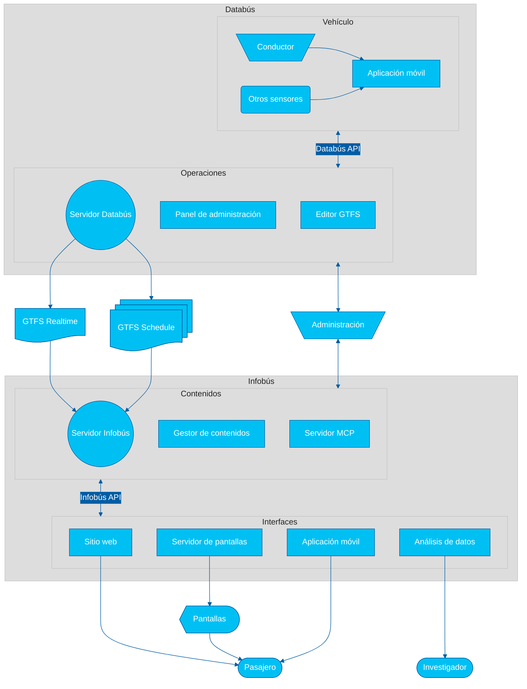

# Sistema

El siguiente diagrama de arquitectura tecnológica ilustra los componentes principales y los flujos de datos de nuestro ecosistema de investigación y desarrollo.

## Databús

> [!NOTE]
> Databús&reg; es una marca registrada de la Universidad de Costa Rica.

### Servidor

Servidor de recolección, creación y distribución de datos del servicio de transporte público. Permite la gestión y distribución de datos estáticos (GTFS _Schedule_) y en tiempo real (GTFS _Realtime_). Expone una API REST.

### Panel de administración

Interfaz de administración del servidor Databús. Permite la gestión de datos estáticos y en tiempo real, así como la configuración del sistema.

### Editor GTFS

Editor de datos estáticos del servicio de transporte público, compatible con el formato **GTFS** _Schedule_. Permite la creación y edición de rutas, paradas, horarios y otros datos relevantes.

### Paquete de Python

Paquete de utilidades y herramientas y CLI (interfaz de línea de comandos) de Python para interactuar con el ecosistema de Databús y sus datos.

### Orquestador de flujo de datos

Plataforma de gestión del flujo de datos para análisis y procesamiento en tiempo real.

### Aplicación móvil operativa

Aplicación móvil operativa para la recolección de datos de rastreo y telemetría de los vehículos de transporte público. Permite a los conductores registrar eventos, como el inicio y fin de recorridos, alertas, y otros datos relevantes.

## Infobús

> [!NOTE]
> Infobús&reg; es una marca registrada de la Universidad de Costa Rica.

### Servidor

Servidor de distribución de información del servicio de transporte público. Permite la gestión y distribución de contenidos para diferentes interfaces, como sitios web, aplicaciones móviles y pantallas.

### Gestor de contenidos

Gestor de contenidos para el servidor Infobús. Permite la creación y edición de contenidos, como noticias, alertas, y otros datos relevantes para las personas usuarias del servicio.

### Servidor MCP

Servidor MCP (_Model Context Protocol_) para la interacción de agentes de inteligencia artificial (IA) con la API de Infobús, con aplicación en chats con modelos extensos de lenguaje (LLMs) y otros sistemas de IA.

### Paquete de Python

Paquete de utilidades y herramientas y CLI (interfaz de línea de comandos) de Python para interactuar con el ecosistema de Infobús y sus datos.

### Sitio web

Sitio web para la consulta de información del servicio de transporte público. Permite a las personas usuarias consultar rutas, horarios, alertas y otros datos relevantes.

### Servidor de pantallas

Servidor de distribución de contenidos para pantallas informativas. Permite la gestión y distribución de contenidos específicos para pantallas ubicadas en paradas, vehículos y otros puntos estratégicos.

### Aplicación móvil

Aplicación móvil para la consulta de información del servicio de transporte público. Permite a las personas usuarias consultar rutas, horarios, alertas y otros datos relevantes desde sus dispositivos móviles.

### Panel de análisis de datos

Panel para el análisis de datos del servicio de transporte público. Permite a investigadores y analistas consultar y visualizar datos históricos y en tiempo real del servicio, facilitando la toma de decisiones informadas.

> [!NOTE]
> TRL es un acrónimo de **Technology Readiness Level** (_Nivel de madurez tecnológica_). Los niveles van del 1 al 9, donde 1 indica una investigación básica y 9 indica que la tecnología está completamente probada y lista para su uso en producción. Puede consultar la [escala aplicada](../TRL.md).
