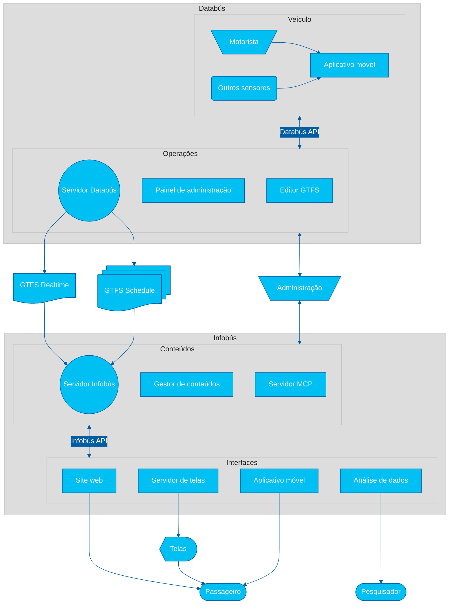

# Sistema

O seguinte diagrama de arquitetura tecnológica ilustra os componentes principais e os fluxos de dados do nosso ecossistema de pesquisa e desenvolvimento.

## Databús

> [!NOTE]
> Databús&reg; é uma marca registrada da Universidade da Costa Rica.

### Servidor

Servidor de coleta, criação e distribuição de dados do serviço de transporte público. Permite a gestão e distribuição de dados estáticos (GTFS _Schedule_) e em tempo real (GTFS _Realtime_). Expõe uma API REST.

### Painel de administração

Interface de administração do servidor Databús. Permite a gestão de dados estáticos e em tempo real, bem como a configuração do sistema.

### Editor GTFS

Editor de dados estáticos do serviço de transporte público, compatível com o formato **GTFS** _Schedule_. Permite a criação e edição de rotas, paradas, horários e outros dados relevantes.

### Pacote Python

Pacote de utilitários e ferramentas e CLI (interface de linha de comando) Python para interagir com o ecossistema Databús e seus dados.

### Orquestrador de fluxo de dados

Plataforma de gestão do fluxo de dados para análise e processamento em tempo real.

### Aplicativo móvel operacional

Aplicativo móvel operacional para a coleta de dados de rastreamento e telemetria dos veículos de transporte público. Permite aos motoristas registrar eventos, como início e fim de percursos, alertas e outros dados relevantes.

## Infobús

> [!NOTE]
> Infobús&reg; é uma marca registrada da Universidade da Costa Rica.

### Servidor

Servidor de distribuição de informações do serviço de transporte público. Permite a gestão e distribuição de conteúdos para diferentes interfaces, como sites, aplicativos móveis e telas.

### Gestor de conteúdos

Gestor de conteúdos para o servidor Infobús. Permite a criação e edição de conteúdos, como notícias, alertas e outros dados relevantes para os usuários do serviço.

### Servidor MCP

Servidor MCP (_Model Context Protocol_) para a interação de agentes de inteligência artificial (IA) com a API do Infobús, com aplicação em chats com modelos extensos de linguagem (LLMs) e outros sistemas de IA.

### Pacote Python

Pacote de utilitários e ferramentas e CLI (interface de linha de comando) Python para interagir com o ecossistema Infobús e seus dados.

### Site web

Site para consulta de informações do serviço de transporte público. Permite aos usuários consultar rotas, horários, alertas e outros dados relevantes.

### Servidor de telas

Servidor de distribuição de conteúdos para telas informativas. Permite a gestão e distribuição de conteúdos específicos para telas localizadas em paradas, veículos e outros pontos estratégicos.

### Aplicativo móvel

Aplicativo móvel para consulta de informações do serviço de transporte público. Permite aos usuários consultar rotas, horários, alertas e outros dados relevantes a partir de seus dispositivos móveis.

### Painel de análise de dados

Painel para análise de dados do serviço de transporte público. Permite a pesquisadores e analistas consultar e visualizar dados históricos e em tempo real do serviço, facilitando a tomada de decisões informadas.

> [!NOTE]
> TRL é um acrônimo de **Technology Readiness Level** (_Nível de Prontidão Tecnológica_). Os níveis vão de 1 a 9, onde 1 indica uma pesquisa básica e 9 indica que a tecnologia está completamente testada e pronta para uso em produção. Pode consultar a [escala aplicada](../TRL.md).
