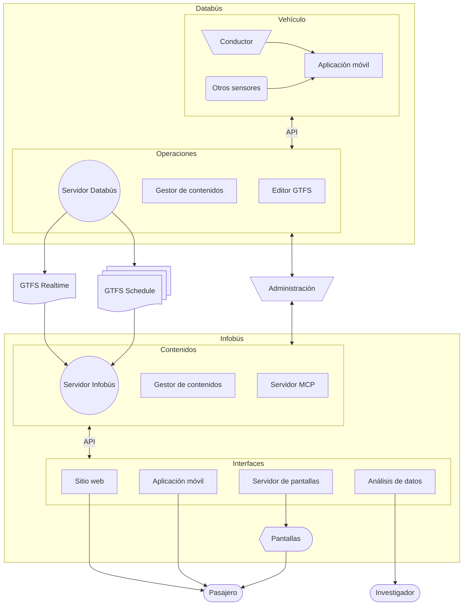

Escuela de Ingeniería Eléctrica | **Universidad de Costa Rica**

[🇨🇷 Español](#nuestro-trabajo) | [🇺🇸 English](#our-work) | [🇧🇷 Português](#nosso-trabalho)

## Nuestro trabajo

Investigamos tecnologías para el análisis de datos del transporte público, con énfasis en sistemas de información para las personas usuarias. Actualmente desarrollamos dos sistemas complementarios:

- **Databús**: plataforma de recolección, creación y distribución de datos del servicio de transporte público, tanto la información estática de rutas, horarios, mapas y otros, como alertas y la información en tiempo real de los vehículos.
- **Infobús**: plataforma de distribución de información del servicio para las personas usuarias del servicio de buses. Incluye múltiples medios digitales, como pantallas, sitios web y otros componentes para el uso de los datos del servicio. 

## Our work

We investigate technologies for the analysis of public transportation data, with an emphasis on information systems for users. We are currently developing two complementary systems:

- **Databús**: a platform for the collection, creation, and distribution of public transportation service data, including both static information such as routes, schedules, and maps, as well as alerts and real-time vehicle information.
- **Infobús**: a service information distribution platform for bus users. It includes multiple digital media, such as screens, websites, and other components for making use of service data.

## Nosso trabalho

Investigamos tecnologias para a análise de dados do transporte público, com ênfase em sistemas de informação para as pessoas usuárias. Atualmente, estamos desenvolvendo dois sistemas complementares:

- **Databús**: plataforma para coleta, criação e distribuição de dados do serviço de transporte público, incluindo tanto informações estáticas como rotas, horários e mapas, quanto alertas e informações em tempo real dos veículos.
- **Infobús**: plataforma de distribuição de informação do serviço para as pessoas usuárias de ônibus. Inclui diversos meios digitais, como telas, sites e outros componentes para o uso dos dados do serviço.

## Sistema

