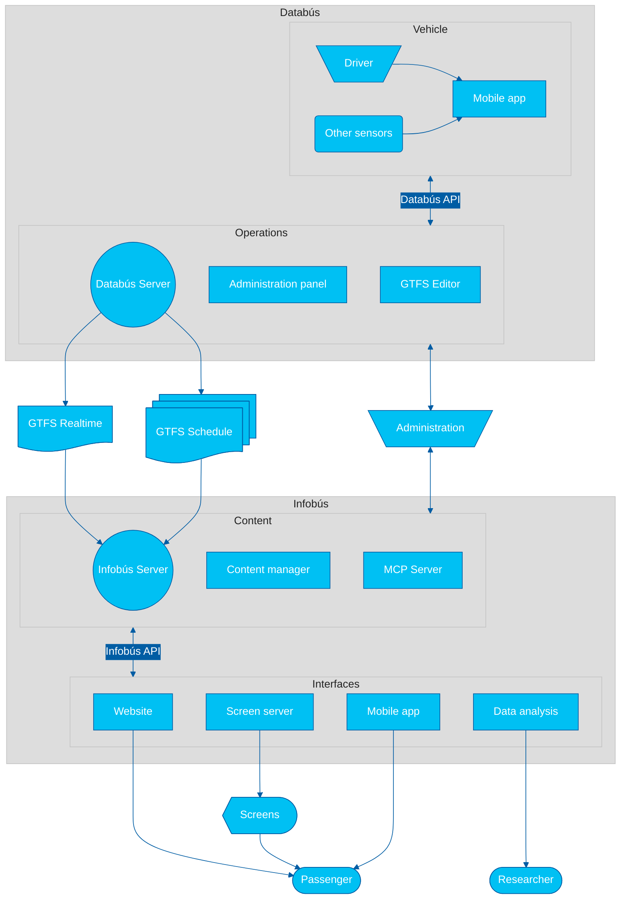

_Intelligent Mobility Systems Lab_ (SIMOVI)

📍 Department of Electrical Engineering | **University of Costa Rica**

> **SIMOVI** is a research laboratory dedicated to advancing intelligent mobility systems through digital technologies, data analytics, and information systems for public transportation. We focus on creating open, standards-based solutions that improve transit accessibility and operational efficiency.

🗺️ **Please check the [SIMOVI Roadmap Overview](https://github.com/simovilab/context/blob/main/roadmap.md) (in English) to collaborate with our laboratory!**

## About us

> [!IMPORTANT]
> **Language Policy**: Most of our documentation is in English to support collaboration with developers around the world and to foster international partnerships in public transportation research. Whenever possible, documentation in Spanish and Portuguese will also be made available for audiences in Ibero-America.
>
> **Política de idiomas**: La mayoría de nuestra documentación está en inglés para apoyar la colaboración con desarrolladores de todo el mundo y fomentar las asociaciones internacionales en investigación del transporte público. Siempre que sea posible, también estará a disposición la documentación en español y portugués para audiencias en Iberoamérica.
>
> **Política de idiomas**: A maioria da nossa documentação está em inglês para apoiar a colaboração com desenvolvedores de todo o mundo e promover parcerias internacionais em pesquisa de transporte público. Sempre que possível, a documentação também será disponibilizada em espanhol e português para audiências na Ibero-América.

📚 [🇨🇷 Español](#nuestro-trabajo) | [🇺🇸 English](#our-work) | [🇧🇷 Português](#nosso-trabalho)

### Our work

We investigate technologies for the analysis of public transportation data, with an emphasis on information systems for users. We are currently developing two complementary systems:

- **Databús**: a platform for the collection, creation, and distribution of public transportation service data, including both static information such as routes, schedules, and maps, as well as alerts and real-time vehicle information.
- **Infobús**: a service information distribution platform for bus users. It includes multiple digital media, such as screens, websites, and other components for making use of service data.

### Nuestro trabajo

Investigamos tecnologías para el análisis de datos del transporte público, con énfasis en sistemas de información para las personas usuarias. Actualmente desarrollamos dos sistemas complementarios:

- **Databús**: una plataforma de _recolección_, _creación_ y _distribución_ de datos del servicio de transporte público, tanto la información estática de rutas, horarios, mapas y otros, como alertas y la información en tiempo real de los vehículos.
- **Infobús**: una plataforma de _distribución_ de información del servicio para las personas usuarias del servicio de buses. Incluye múltiples medios digitales, como pantallas, sitios web y otros componentes para el uso de los datos del servicio.

### Nosso trabalho

Investigamos tecnologias para a análise de dados do transporte público, com ênfase em sistemas de informação para as pessoas usuárias. Atualmente, estamos desenvolvendo dois sistemas complementares:

- **Databús**: uma plataforma para _coleta_, _criação_ e _distribuição_ de dados do serviço de transporte público, incluindo tanto informações estáticas como rotas, horários e mapas, quanto alertas e informações em tempo real dos veículos.
- **Infobús**: uma plataforma de _distribuição_ de informação do serviço para as pessoas usuárias de ônibus. Inclui diversos meios digitais, como telas, sites e outros componentes para o uso dos dados do serviço.

## System

The following technological architecture diagram illustrates the core components and data flows of our research and development ecosystem.

✏️ Check our [system design principles](https://github.com/simovilab/context/blob/main/system_design_principles.md) for further reference on this architecture.

## Databús

> [!NOTE]
> Databús&reg; is a registered trademark of the University of Costa Rica.

### Server

Server for collection, creation and distribution of public transportation service data. Enables management and distribution of static data (GTFS _Schedule_) and real-time data (GTFS _Realtime_). Exposes a REST API.

### Administration Panel

Administration interface for the Databús server. Enables management of static and real-time data, as well as system configuration.

### Content Management System

Content management system for the Databús operational side. Enables management of content delivered through technical and administrative channels.

### GTFS Editor

Editor for static public transportation service data, compatible with the **GTFS** _Schedule_ format. Enables creation and editing of routes, stops, schedules and other relevant data.

### Python Package

Package of utilities and tools and CLI (command line interface) for Python to interact with the Databús ecosystem and its data.

### Data Flow Orchestrator

Data flow management platform for real-time analysis and processing.

### Stop Times Estimator

Arrival time estimation module based on historical data and time series prediction algorithms developed in-house.

### Django App for GTFS Handling

Django application with utilities for database management and GTFS import/export, validation, and other related tasks.

### Operational Mobile Application

Operational mobile application for collecting tracking and telemetry data from public transportation vehicles. Enables drivers to register events, such as trip start and end, alerts, and other relevant data.

## Infobús

> [!NOTE]
> Infobús&reg; is a registered trademark of the University of Costa Rica.

### Server

Server for distribution of public transportation service information. Enables management and distribution of content for different interfaces, such as websites, mobile applications and screens.

### Administration Panel

Administration interface for the Infobús server. Enables management of communication channels, as well as system configuration.

### Content Management System

Content management system for the Infobús server. Enables creation and editing of content, such as news, alerts, and other relevant data for service users.

### MCP Client / Server

MCP (_Model Context Protocol_) server for interaction of artificial intelligence (AI) agents with the Infobús API, with application in chats with large language models (LLMs) and other AI systems.

### Python Package

Package of utilities and tools and CLI (command line interface) for Python to interact with the Infobús ecosystem and its data.

### Website

Website for querying public transportation service information. Enables users to query routes, schedules, alerts and other relevant data.

### Screen Server

Content distribution server for informational screens. Enables management and distribution of specific content for screens located at stops, vehicles and other strategic points.

### Mobile Application

Mobile application for querying public transportation service information. Enables users to query routes, schedules, alerts and other relevant data from their mobile devices.

### Data Analysis Panel

Panel for analysis of public transportation service data. Enables researchers and analysts to query and visualize historical and real-time service data, facilitating informed decision-making.

> [!NOTE]
> TRL is an acronym for **Technology Readiness Level**. The levels range from 1 to 9, where 1 indicates basic research and 9 indicates that the technology is fully tested and ready for production use. You can check the [scale applied here](https://github.com/simovilab/context/blob/main/trl.md).
