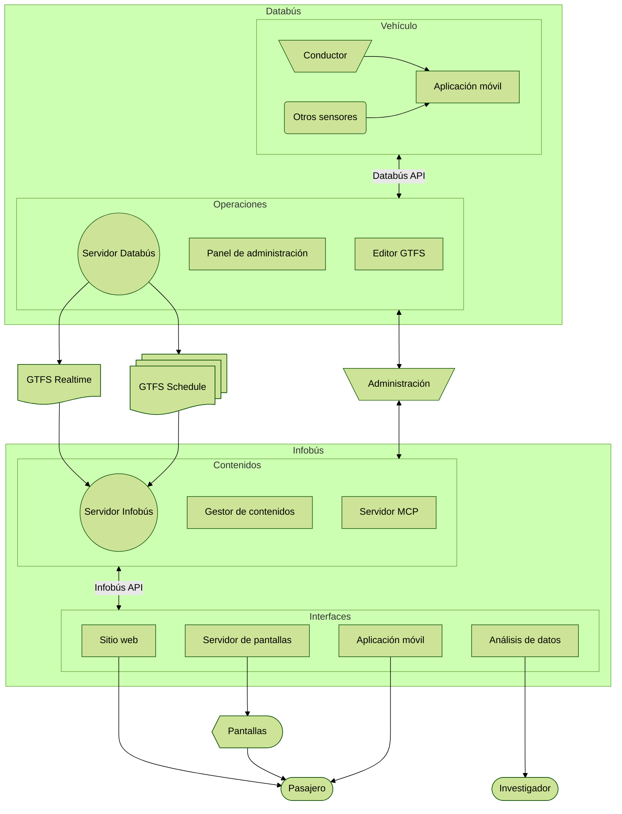

Escuela de Ingeniería Eléctrica | **Universidad de Costa Rica**

[🇨🇷 Español](#nuestro-trabajo) | [🇺🇸 English](#our-work) | [🇧🇷 Português](#nosso-trabalho)

## Nuestro trabajo

Investigamos tecnologías para el análisis de datos del transporte público, con énfasis en sistemas de información para las personas usuarias. Actualmente desarrollamos dos sistemas complementarios:

- **Databús**: plataforma de recolección, creación y distribución de datos del servicio de transporte público, tanto la información estática de rutas, horarios, mapas y otros, como alertas y la información en tiempo real de los vehículos.
- **Infobús**: plataforma de distribución de información del servicio para las personas usuarias del servicio de buses. Incluye múltiples medios digitales, como pantallas, sitios web y otros componentes para el uso de los datos del servicio.

## Our work

We investigate technologies for the analysis of public transportation data, with an emphasis on information systems for users. We are currently developing two complementary systems:

- **Databús**: a platform for the collection, creation, and distribution of public transportation service data, including both static information such as routes, schedules, and maps, as well as alerts and real-time vehicle information.
- **Infobús**: a service information distribution platform for bus users. It includes multiple digital media, such as screens, websites, and other components for making use of service data.

## Nosso trabalho

Investigamos tecnologias para a análise de dados do transporte público, com ênfase em sistemas de informação para as pessoas usuárias. Atualmente, estamos desenvolvendo dois sistemas complementares:

- **Databús**: plataforma para coleta, criação e distribuição de dados do serviço de transporte público, incluindo tanto informações estáticas como rotas, horários e mapas, quanto alertas e informações em tempo real dos veículos.
- **Infobús**: plataforma de distribuição de informação do serviço para as pessoas usuárias de ônibus. Inclui diversos meios digitais, como telas, sites e outros componentes para o uso dos dados do serviço.

## Sistema

## Subsistemas

### Databús

#### Servidor `databus` [:link:](https://github.com/simovilab/databus)

Servidor de recolección, creación y distribución de datos del servicio de transporte público. Permite la gestión y distribución de datos estáticos (GTFS _Schedule_) y en tiempo real (GTFS _Realtime_). Expone una API REST.

#### Panel de administración `databus-admin` [:link:](https://github.com/simovilab/databus-admin)

Interfaz de administración del servidor Databús. Permite la gestión de datos estáticos y en tiempo real, así como la configuración del sistema.

#### Editor GTFS `databus-editor` [:link:](https://github.com/simovilab/databus-editor)

Editor de datos estáticos del servicio de transporte público, compatible con el formato **GTFS** _Schedule_. Permite la creación y edición de rutas, paradas, horarios y otros datos relevantes.

#### Aplicación móvil operativa `databus-app` [:link:](https://github.com/simovilab/databus-app)

Aplicación móvil operativa para la recolección de datos de rastreo y telemetría de los vehículos de transporte público. Permite a los conductores registrar eventos, como el inicio y fin de recorridos, alertas, y otros datos relevantes.

### Infobús

#### Servidor `infobus` [:link:](https://github.com/simovilab/infobus)

Servidor de distribución de información del servicio de transporte público. Permite la gestión y distribución de contenidos para diferentes interfaces, como sitios web, aplicaciones móviles y pantallas.

#### Gestor de contenidos `infobus-cms` [:link:](https://github.com/simovilab/infobus-cms)

Gestor de contenidos para el servidor Infobús. Permite la creación y edición de contenidos, como noticias, alertas, y otros datos relevantes para las personas usuarias del servicio.

#### Servidor MCP `infobus-mcp` [:link:](https://github.com/simovilab/infobus-mcp)

Servidor MCP (_Model Context Protocol_) para la interacción de agentes de inteligencia artificial (IA) con la API de Infobús, con aplicación en chats con modelos extensos de lenguaje (LLMs) y otros sistemas de IA.

#### Sitio web `infobus-web` [:link:](https://github.com/simovilab/infobus-web)

Sitio web para la consulta de información del servicio de transporte público. Permite a las personas usuarias consultar rutas, horarios, alertas y otros datos relevantes.

#### Servidor de pantallas `infobus-screens` [:link:](https://github.com/simovilab/infobus-screens)

Servidor de distribución de contenidos para pantallas informativas. Permite la gestión y distribución de contenidos específicos para pantallas ubicadas en paradas, vehículos y otros puntos estratégicos.

#### Aplicación móvil `infobus-app` [:link:](https://github.com/simovilab/infobus-app)

Aplicación móvil para la consulta de información del servicio de transporte público. Permite a las personas usuarias consultar rutas, horarios, alertas y otros datos relevantes desde sus dispositivos móviles.

#### Panel de análisis de datos `infobus-data` [:link:](https://github.com/simovilab/infobus-data)

Panel para el análisis de datos del servicio de transporte público. Permite a investigadores y analistas consultar y visualizar datos históricos y en tiempo real del servicio, facilitando la toma de decisiones informadas.
