_Intelligent Mobility Systems Lab_ (SIMOVI)

📍 Department of Electrical Engineering | **University of Costa Rica**

> **SIMOVI** is a research laboratory dedicated to advancing intelligent mobility systems through digital technologies, data analytics, and information systems for public transportation. We focus on creating open, standards-based solutions that improve transit accessibility and operational efficiency.

For a quick orientation, see the [System Overview](#system-overview) below and explore these key documents to collaborate with our lab:

- **SIMOVI Public Roadmap** — Project goals, milestones, and research directions ([read more](https://github.com/orgs/simovilab/projects/2))
- **System Design Principles** — Architectural guidelines and best practices ([read more](https://github.com/simovilab/context/blob/main/system_design_principles.md))
- **Data Principles** — Data management and interoperability standards ([read more](https://github.com/simovilab/context/blob/main/data_principles.md))
- **Technology Stack** — Core technologies and tools used in our ecosystem ([read more](https://github.com/simovilab/context/blob/main/tech_stack.md))

### Contact Info

**Fabián Abarca**
 
_Research Group Leader_
 
fabian.abarca@ucr.ac.cr
|
[GitHub](https://github.com/fabianabarca)
|
[Twitter](https://twitter.com/fabianabarca)

## About us

### 🇺🇸 Our work

We investigate technologies for the analysis of public transportation data, with an emphasis on information systems for users. We are currently developing two complementary systems:

- **Databús**: a platform for the collection, creation, and distribution of public transportation service data, including both static information such as routes, schedules, and maps, as well as alerts and real-time vehicle information.
- **Infobús**: a service information distribution platform for bus users. It includes multiple digital media, such as screens, websites, and other components for making use of service data.

### 🇨🇷 Nuestro trabajo

Investigamos tecnologías para el análisis de datos del transporte público, con énfasis en sistemas de información para las personas usuarias. Actualmente desarrollamos dos sistemas complementarios:

- **Databús**: una plataforma de _recolección_, _creación_ y _distribución_ de datos del servicio de transporte público, tanto la información estática de rutas, horarios, mapas y otros, como alertas y la información en tiempo real de los vehículos.
- **Infobús**: una plataforma de _distribución_ de información del servicio para las personas usuarias del servicio de buses. Incluye múltiples medios digitales, como pantallas, sitios web y otros componentes para el uso de los datos del servicio.

### 🇧🇷 Nosso trabalho

Investigamos tecnologias para a análise de dados do transporte público, com ênfase em sistemas de informação para as pessoas usuárias. Atualmente, estamos desenvolvendo dois sistemas complementares:

- **Databús**: uma plataforma para _coleta_, _criação_ e _distribuição_ de dados do serviço de transporte público, incluindo tanto informações estáticas como rotas, horários e mapas, quanto alertas e informações em tempo real dos veículos.
- **Infobús**: uma plataforma de _distribuição_ de informação do serviço para as pessoas usuárias de ônibus. Inclui diversos meios digitais, como telas, sites e outros componentes para o uso dos dados do serviço.

> [!IMPORTANT]
> 🇺🇸 **Language Policy**: Most documentation is in English to support global collaboration and international research. Spanish and Portuguese versions are provided for Ibero-American audiences whenever possible.
>
> 🇨🇷 **Política de idiomas**: La mayor parte de la documentación está en inglés para facilitar la colaboración global e internacional. Cuando sea posible estará disponible en español y portugués para audiencias de Iberoamérica.
>
> 🇧🇷 **Política de idiomas**: A maior parte da documentação está em inglês para colaboração e pesquisa internacional. Espanhol e português disponíveis para a Ibero-América sempre que possível.

## System Overview

The following technological architecture diagram illustrates the core components and data flows of our research and development ecosystem.

```mermaid
%%{
  init: {
    'theme': 'base',
    'themeVariables': {
      'primaryColor': '#00C0F3',
      'primaryTextColor': '#fff',
      'primaryBorderColor': '#005DA4',
      'lineColor': '#005DA4',
      'secondaryColor': '#005DA4',
      'tertiaryColor': '#DDDDDD'
    }
  }
}%%
flowchart TD
    subgraph Databús
        subgraph Vehicle
            OPE@{ shape: manual, label: "Driver"}
            SEN@{ shape: event, label: "Other sensors"}
            OBE[Mobile app]
        end
        subgraph Operations
            GTFS[GTFS Editor]
            DCMS[Administration panel]
            DAT((Databús Server))
        end
    end

    SC@{ shape: docs, label: "GTFS Schedule"}
    RT@{ shape: doc, label: "GTFS Realtime"}
    ADM@{ shape: manual, label: "Administration"}

    subgraph Infobús
        subgraph Content
            INF((Infobús Server))
            ICMS[Content manager]
            MCP[MCP Server]
        end
        subgraph Interfaces
            WEB[Website]
            SSC[Screen server]
            APP[Mobile app]
            ANA[Data analysis]
        end

    end
    SCR@{ shape: display, label: "Screens"}
    PAS@{ shape: terminal, label: "Passenger"}
    RES@{ shape: terminal, label: "Researcher"}

OPE --> OBE
SEN --> OBE
Vehicle <--Databús API--> Operations
DAT --> RT
DAT --> SC

RT --> INF
SC --> INF

Content <--Infobús API--> Interfaces

WEB --> PAS
SSC --> SCR
SCR --> PAS
APP --> PAS
ANA ---> RES

Operations <--> ADM
ADM <--> Content

```

There are currently 18 repositories under development, described below.

## Databús

Data collection and processing subsystem for public transportation operations.

### Server

Core backend server implementing GTFS Schedule and GTFS Realtime specifications for comprehensive transit data management. Provides RESTful API endpoints for static schedule data (routes, stops, trips) and real-time vehicle information (positions, alerts, service updates) with PostgreSQL/PostGIS storage and real-time data validation.

### Administration Panel

Web-based administrative dashboard for transit operators to manage GTFS datasets, configure real-time feeds, monitor system health, and oversee data quality validation processes. Features role-based access control and operational metrics visualization.

### Content Management System

Headless CMS for managing operational content including service alerts, system announcements, and technical documentation. Supports multilingual content creation with workflow management for transit authority communications and API-first content delivery.

### GTFS Editor

Interactive web application for creating and editing GTFS Schedule datasets with visual map interface, route planning tools, stop management, and schedule optimization. Includes GTFS validation, export functionality, and collaborative editing capabilities for transit planning teams.

### Python Package

Python SDK and command-line toolkit for GTFS data processing, validation, and analysis. Provides programmatic access to Databús APIs, GTFS manipulation utilities, data conversion tools, and automated testing frameworks for transit data workflows and research applications.

### Data Flow Orchestrator

Real-time data pipeline orchestration system using Apache Airflow for streaming vehicle positions, managing data transformations, and coordinating ETL processes.

### Stop Times Estimator

Machine learning service for predicting vehicle arrival times using historical GTFS data, real-time vehicle positions, and traffic patterns. Implements time series forecasting algorithms (LSTM, ARIMA) with continuous model retraining and heuristic search algorithms.

### Django App for GTFS Handling

Reusable Django application providing GTFS data models, import/export utilities, validation services, and database optimization for transit applications. Features automated GTFS zip processing, data integrity checks, and ORM integration for rapid transit app development.

### Operational Mobile Application

Cross-platform mobile application for bus drivers, trip dispatchers and fleet operators to collect real-time vehicle telemetry, GPS tracking, and operational events.

## Infobús

Information distribution subsystem for passenger-facing services.

### Server

Multi-tenant information distribution platform consuming GTFS Schedule and Realtime, and other real-time data to deliver passenger information across multiple channels. Provides GraphQL and RESTful APIs for trip planning, stop information and real-time arrivals, among others.

### Administration Panel

Administrative interface for managing passenger information services, configuring display channels, monitoring system performance, and controlling content distribution across digital displays, websites, and mobile applications with analytics and usage reporting.

### Content Management System

Passenger-focused content management platform for creating and publishing transit information including service updates, emergency alerts, promotional content, and accessibility information. Features scheduled publishing, template management, and multi-channel content syndication.

### MCP Client / Server

Model Context Protocol server enabling AI assistants and chatbots to access transit information through standardized interfaces. Provides tools for trip planning, real-time information queries, and natural language transit assistance with integration support for LLMs and conversational AI platforms.

### Python Package

Python client library and CLI tools for accessing Infobús APIs, building passenger information applications, and integrating transit data into research workflows. Includes trip planning algorithms, data visualization utilities, and automated testing frameworks for passenger information systems.

### Website

Progressive web application providing comprehensive trip planning, real-time vehicle tracking, and stop information for transit passengers. Features responsive design, offline functionality, accessibility compliance (WCAG 2.1), and integration with mapping services for route visualization.

### Screen Server

Digital signage system for displaying real-time transit information on screens at bus stops, stations, and vehicles. Supports dynamic content layouts, remote configuration, offline resilience, and hardware integration with various display technologies and embedded systems.

### Mobile Application

Native mobile application for iOS and Android providing personalized transit experience with trip planning, real-time notifications, favorite routes, accessibility features, and location-based services. Includes offline maps, push notifications for service disruptions, and user preference management.

### Data Analysis Panel

Business intelligence dashboard for transit agencies and researchers to analyze ridership patterns, service performance metrics, and operational efficiency. Features interactive visualizations, custom reporting, statistical analysis tools, and data export capabilities for evidence-based transit planning decisions.

> [!NOTE]
> TRL is an acronym for **Technology Readiness Level**. The levels range from 1 to 9, where 1 indicates basic research and 9 indicates that the technology is fully tested and ready for production use. You can check the [applied scale here](https://github.com/simovilab/context/blob/main/trl.md).

> [!NOTE]
> Databús&reg; and Infobús&reg; are registered trademarks of the University of Costa Rica.
